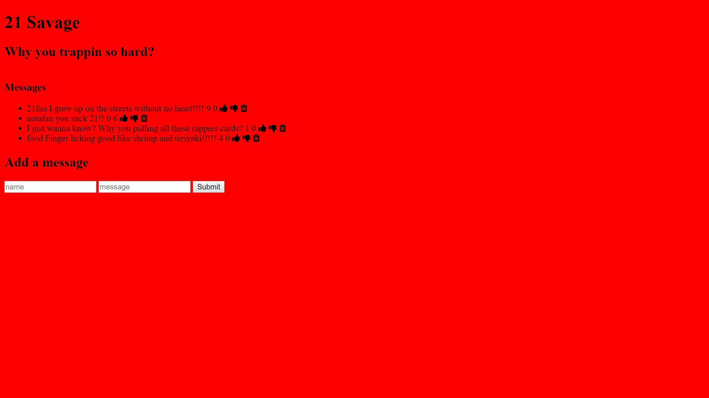

Simple Express App

This is my first taste of making a fullstack application. This is an app for 21 savage fans to post their name and answer a question about the rapper. After posting messages they can be given a thumbs up for approval or thumbs down for disapproval and if they posted a message incorrectly it can be deleted. All of this info is stored into a database via mongo.

Demo:https://rakimdevcraig.github.io/simpleFullStackApp/

How It's Made:
Tech used: HTML, CSS, Javascript, Node, Express, Mongo, Embedded Javascript

I started off by using Node and Express to create a server that my browser can connect to. After ensuring my server was up and running I created a form in Embedded Javascript that the user can input info to. After that I linked my Mongo database to the form so when information gets entered it also gets stored into the database.

Optimizations:
At first this app only had the ability for the user to provide a thumb up to messages but I added the ability for the user to give a thumb down or to also delete a message.

Lessons Learned: I created an express server, learned to execute CRUD operations, save and read from MongoDB and I also learned to use a template engine like Embedded JS. Ontop of that I had to learned how to install  Node, Express and MongoDB into my apps.

## Installation

1. Clone repo
2. run `npm install`

## Usage

1. run `npm run savage`
2. Navigate to `localhost:8000`
